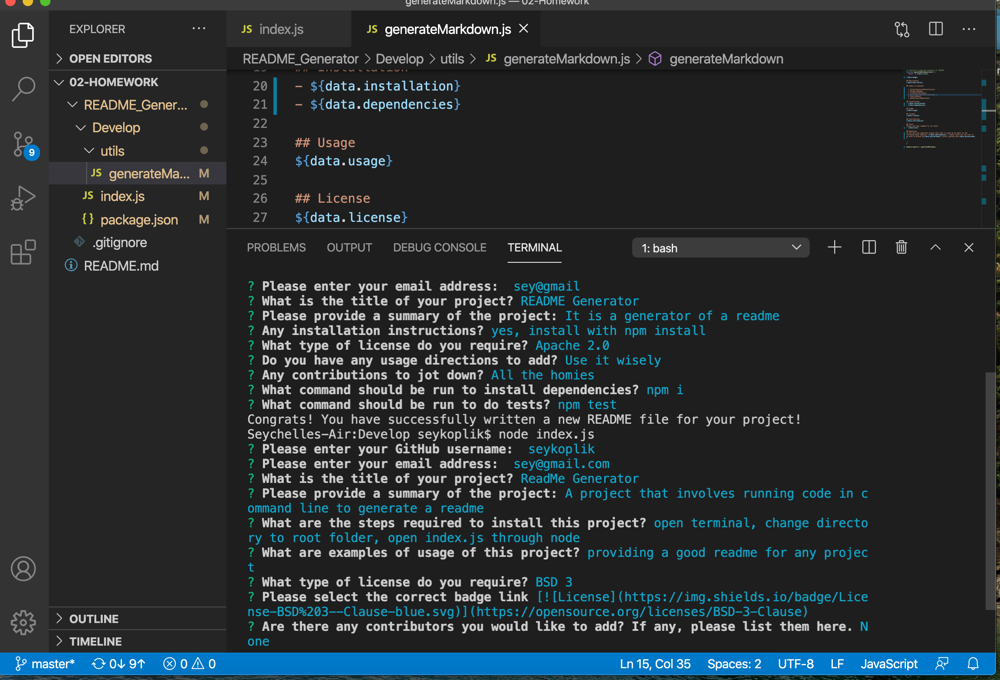
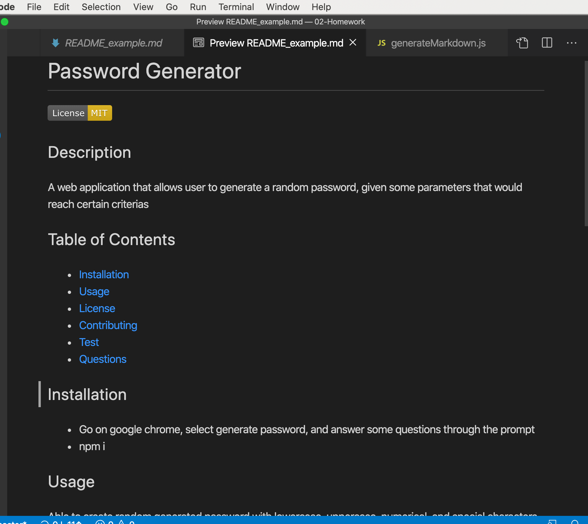

# Node.js Homework -- Good README Generator

## Description
This homework is created to generate a README for a project that it is uploaded into the repository using the command line interface. User is given a series of questions via the command line to answer to fill in sections of the readme and in the end, user is provided with a .md file of the readme that was generated.

## Usage
Using command line interface to interact using inquirer prompts to create a readme file.

## Preview

## Installation
How to operate project: do an npm install of the inquirer and its associated dependencies and run node index.js of the root folder in the command line to answer a series of prompts to create the readme file.

## Attributes
node.js
inquirer
markdown

## Links
<a href="https://drive.google.com/file/d/1w4ycMWNi6OqlHHDp0D7a5fmXbjicMRyK/view" target=_new>Video Demo of CLI operation</a>

<a href="https://github.com/SeyKoplik/README_Generator/blob/master/Develop/README_example.md" target=_new>README_example.md file generated</a>

--- 
© 2020 Seychelle Koplik